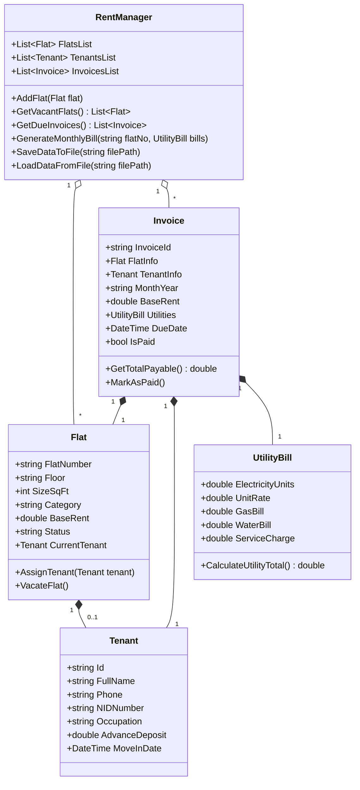

# 🏠 SmartRent Manager (বাসা ভাড়া ও ভাড়াটিয়া ব্যবস্থাপনা সিস্টেম)
### Complete UI/UX Design System Specification & Architecture Guide

---

## ১. ওভারভিউ ও উদ্দেশ্য (System Overview)

**SmartRent Manager** বাস্তব জীবনে ঢাকা এবং বাংলাদেশের যেকোনো শহরতলীতে ব্যাচেলর মেস ও ফ্যামিলি বাসার বাড়িওয়ালা (Landlord), কেয়ারটেকার ও মেস ম্যানেজারদের জন্য একটি উচ্চ-দক্ষতাসম্পন্ন **UI/UX ডিজাইন ও ম্যানেজমেন্ট ফ্রেমওয়ার্ক**।

এই সিস্টেমে নিচের মূল সমস্যাগুলোর আধুনিক ডিজিটাল সমাধান প্রদান করা হয়েছে:
1. **ফ্ল্যাট ও রুমের তথ্য ডিজিটালাইজেশন**: রুম নম্বর, ফ্লোর, স্কয়ার ফিট, ক্যাটাগরি (ব্যাচেলর/ফ্যামিলি), বেস রেন্ট।
2. **ভাড়াটিয়ার কেওয়াইসি (KYC) ও প্রোফাইল ট্র্যাকিং**: নাম, মোবাইল নম্বর, NID কার্ড নম্বর, পেশা, জামানত (Advance Deposit)।
3. **স্বয়ংক্রিয় মাসিক বিল ক্যালকুলেশন**: মূল বাড়ি ভাড়া + প্রিপেইড/পোস্টপেইড বিদ্যুৎ বিল (ইউনিট রেট) + গ্যাস বিল + পানির বিল + সার্ভিস চার্জ।
4. **রিয়েল-টাইম স্ট্যাটাস মনিটরিং**: কোন ফ্ল্যাট ফাঁকা (Vacant), কোন ফ্ল্যাট পেইড (PAID) এবং কোনটায় বকেয়া (DUE) রয়েছে তা তাৎক্ষণিক ফিল্টারিং।
5. **প্রিন্ট-রেডি মানি রসিদ (Money Receipt / Voucher)**: বাড়িওয়ালা ও ভাড়াটিয়ার স্বাক্ষর সম্বলিত আনুষ্ঠানিক ভাড়ার রসিদ।

---

## ২. UI/UX ডিজাইন সিস্টেম ও ভিজ্যুয়াল গাইডলাইন (Design System)

### ২.১ কালার প্যালেট (Color Palette & Tokens)

| ভূমিকা (Role) | কালার কোড (Hex / Tailwind) | উদ্দেশ্য ও ব্যবহার |
| :--- | :--- | :--- |
| **Primary Brand** | `#4F46E5` (`indigo-600`) | প্রাইমারি অ্যাকশন বাটন, লোগো অ্যাকসেন্ট, ফোকাস রিং |
| **Success / Paid** | `#059669` (`emerald-600`) | পরিশোধিত ভাড়ার ব্যাজ (`PAID ✔`), কনফার্মেশন অ্যাকশন |
| **Danger / Due** | `#E11D48` (`rose-600`) | বকেয়া ভাড়ার অ্যালার্ট (`DUE ⚠️`), আনপেইড স্ট্যাটাস, তাগাদা বাটন |
| **Warning / Vacant**| `#D97706` (`amber-600`) | ফাঁকা ফ্ল্যাট (`VACANT 🚪`), ইনভয়েস জেনারেট বাটন |
| **Surface Background** | `#F8FAFC` (`slate-50`) | মূল পেইজ ব্যাকগ্রাউন্ড (চোখের জন্য আরামদায়ক) |
| **Card Surface** | `#FFFFFF` (`white`) | কার্ড কনটেইনার, টেবিল সারফেস, প্রিন্ট রসিদ |
| **Dark Header Bar** | `#0F172A` (`slate-900`) | মূল নেভিগেশন ট্যাব বার (কনট্রাস্ট ও প্রিমিয়াম লুক) |

### ২.২ টাইপোগ্রাফি (Typography)
- **ইংরেজি ফন্ট**: `Plus Jakarta Sans` / `Inter` (আধুনিক, পরিচ্ছন্ন নিউমেরিক রিডিবিলিটি)
- **বাংলা ফন্ট**: `Hind Siliguri` (সহজপাঠ্য বাংলা মাইক্রোকপি ও রসিদের বর্ণনা)
- **ডাটা ও অ্যামাউন্ট**: `font-mono` / `font-black` (BDT ৳ সংখ্যার নিখুঁত অ্যালাইনমেন্ট)

---

## ৩. লেআউট ও ওয়্যারফ্রেম হায়ারার্কি (Layout & Wireframe Hierarchy)

```
+--------------------------------------------------------------------------------------------------+
|  [Logo] SmartRent Manager                     Search Flat / Tenant... [Q]         [Admin Profile]|
+--------------------------------------------------------------------------------------------------+
|  [🏠 Dashboard]   [🏢 Flats]   [👥 Tenants]   [📄 Invoices & Bills]   [📊 Reports]   [⚙️ Settings] |
+--------------------------------------------------------------------------------------------------+
|                                                                                                  |
|  STAT CARDS (Top Overview)                                                                       |
|  +--------------------+  +--------------------+  +--------------------+  +--------------------+  |
|  | Total Flats        |  | Occupied Flats     |  | Vacant Flats       |  | Total Due Amount   |  |
|  |       12           |  |    9 (75%)         |  |   3 (Available)    |  |    42,500 BDT      |  |
|  | +2 added this year |  | 9 Active leases    |  | Ready to rent      |  | 3 Invoices unpaid  |  |
|  +--------------------+  +--------------------+  +--------------------+  +--------------------+  |
|                                                                                                  |
|  QUICK ACTIONS:  [ + Add New Flat ]   [ 👤 Assign Tenant ]   [ 🧾 Generate Monthly Bill ]        |
|  FILTERS:        [ All (12) ]   [ Occupied (9) ]   [ Vacant (3) ]   [ ⚠️ Due (3) ]               |
|                                                                                                  |
|  FLAT STATUS GRID                                                                                |
|  +-----------------------+ +-----------------------+ +-----------------------+ +----------------+ |
|  | Flat: 101   [VACANT]  | | Flat: 102  [OCCUPIED] | | Flat: 201  [OCCUPIED] | | Flat: 202... | |
|  | Floor: 1st            | | Floor: 1st            | | Floor: 2nd            | |                | |
|  | Rent: 12,000 BDT      | | Tenant: Tanvir Ahmed  | | Tenant: Sakib Hasan   | |                | |
|  | 2 Bed, 1 Bath         | | Rent: 12,000 BDT      | | Rent: 14,000 BDT      | |                | |
|  |                       | | Status: [ PAID ✔ ]    | | Status: [ DUE ⚠️ ]    | |                | |
|  | [ Assign Tenant ]     | | [ View Receipt ]      | | [ Send Reminder ]     | |                | |
|  +-----------------------+ +-----------------------+ +-----------------------+ +----------------+ |
|                                                                                                  |
|  RECENT UNPAID INVOICES (Action Required)                                                        |
|  +--------+---------------+--------------------+---------------+-------------+-----------------+  |
|  | Flat   | Tenant Name   | Month              | Amount        | Due Date    | Action          |  |
|  +--------+---------------+--------------------+---------------+-------------+-----------------+  |
|  | 201    | Sakib Hasan   | October 2026       | 17,800 BDT    | Oct 10      | [ Mark as Paid] |  |
|  | 202    | Mahmudul Hasan| October 2026       | 17,400 BDT    | Oct 10      | [ Mark as Paid] |  |
|  | 301    | Farhan Kabir  | October 2026       | 16,300 BDT    | Oct 10      | [ Mark as Paid] |  |
|  +--------+---------------+--------------------+---------------+-------------+-----------------+  |
+--------------------------------------------------------------------------------------------------+
```

---

## ৪. ইউজার জার্নি ও ইন্টারেকশন ফ্লো (User Interaction Flows)

```mermaid
flowchart TD
    Start([বাড়িওয়ালা ড্যাশবোর্ডে প্রবেশ করলেন]) --> StatCheck[টপ ওভারভিউ স্ট্যাটাস চেক: বকেয়া ও ফাঁকা ফ্ল্যাট]
    
    StatCheck --> Choice{কোন কাজটি করতে চান?}
    
    %% Flow 1: New Flat
    Choice -->|নতুন ফ্ল্যাট যোগ| AddFlatModal[Add Flat Modal]
    AddFlatModal --> EnterFlat[রুম নং + ফ্লোর + সাইজ + মূল ভাড়া ইনপুট]
    EnterFlat --> SaveFlat[ফ্ল্যাট তালিকায় যুক্ত হলো - Vacant হিসেবে]
    
    %% Flow 2: Assign Tenant
    Choice -->|ফাঁকা ফ্ল্যাটে ভাড়াটিয়া তোলা| AssignModal[Assign Tenant Modal]
    AssignModal --> EnterTenant[নাম + NID + মোবাইল + জামানত জমা]
    EnterTenant --> UpdateOcc[ফ্ল্যাটের স্ট্যাটাস Occupied হলো]
    
    %% Flow 3: Monthly Bill
    Choice -->|মাসিক ভাড়ার রসিদ তৈরি| BillGen[Monthly Bill Generator]
    BillGen --> Calc[মূল ভাড়া + (বিদ্যুৎ ইউনিট × ৯.৫) + গ্যাস + পানি + সার্ভিস চার্জ]
    Calc --> IssueInvoice[ইনভয়েস তৈরি হলো - Due স্ট্যাটাস]
    
    %% Flow 4: Collection
    Choice -->|ভাড়া আদায় ও রসিদ| DueList[বকেয়া তালিকা থেকে Mark as Paid]
    DueList --> PrintReceipt[প্রিন্ট উপযোগী ভাড়ার মানি রসিদ জেনারেশন]
```

---

## ৫. বিল ক্যালকুলেশন লজিক (Bangladeshi Utility Calculation Logic)

বাস্তব জীবনে বাসা ভাড়ায় প্রতিটি কম্পোনেন্টের সূত্র:

$$\text{Total Bill} = \text{Base Rent} + \text{Electricity Bill} + \text{Gas Bill} + \text{Water Bill} + \text{Service Charge}$$

1. **মূল বাসা ভাড়া (Base Rent)**: চুক্তি অনুযায়ী নির্ধারিত (যেমন: ৳ ১২,০০০ – ১৫,০০০ BDT)
2. **বিদ্যুৎ বিল (Electricity Bill)**: 
   $$\text{Electricity Bill} = \text{Used Units (kWh)} \times \text{Unit Rate (৳ ৯.৫০)}$$
3. **গ্যাস বিল (Gas Bill)**: সরকারি ডাবল বার্নার ফিক্সড রেট (সাধারণত ৳ ১,০৮০ BDT) অথবা সিলিন্ডার গ্যাস শেয়ার।
4. **পানির বিল (Water Bill)**: ওয়াসা (WASA) অনুপাতে ফিক্সড (৳ ৫০০ – ৮০০ BDT)।
5. **সার্ভিস চার্জ (Service Charge)**: দারোয়ান, গার্ড, লিফট, ময়লা বিল (৳ ৫০০ – ১,০০০ BDT)।

---

## ৬. ব্যাকএন্ড ও অবজেক্ট-ওরিয়েন্টেড আর্কিটেকচার (OOP Mapping Guide)

যেহেতু এই প্রজেক্টের একটি মূল শিক্ষণীয় উদ্দেশ্য হলো: **OOP, Calculation Logic, Collection (`List<T>`), এবং ডেটা ফাইলে সেভ রাখা**, নিচে তার ক্লাস মডেল স্ট্রাকচার দেওয়া হলো:

### ৬.১ ক্লাস স্ট্রাকচার ডায়াগ্রাম (Class Diagram)



### ৬.২ ডাটা ফাইল স্টোরেজ ফরম্যাট (JSON File Persistence Format)

ডেটা ফাইলে সংরক্ষণ করার জন্য সহজ ও নিরাপদ ফরম্যাট: `rent_data.json`:

```json
{
  "flats": [
    {
      "flatNumber": "102",
      "floor": "1st Floor",
      "sizeSqFt": 850,
      "category": "Family",
      "baseRent": 12000,
      "status": "Occupied",
      "tenant": {
        "fullName": "Tanvir Ahmed",
        "phone": "01712-345678",
        "nidNumber": "1988269250001423",
        "occupation": "Software Engineer",
        "advanceDeposit": 24000
      }
    }
  ],
  "invoices": [
    {
      "invoiceId": "INV-2026-102",
      "flatNumber": "102",
      "month": "October 2026",
      "baseRent": 12000,
      "electricityBill": 1240,
      "gasBill": 1080,
      "waterBill": 600,
      "serviceCharge": 500,
      "totalAmount": 15420,
      "isPaid": true,
      "dueDate": "2026-10-10"
    }
  ]
}
```

---

## ৭. প্রোটোটাইপের মূল ফিচারসমূহের তালিকা (Features Included in Prototype)

1. **ইন্টারেক্টিভ ড্যাশবোর্ড**:
   - রিয়েলটাইম ৪টি স্ট্যাট কার্ড (মোট ফ্ল্যাট, অকুপাইড, ফাঁকা, মোট বকেয়া টাকা)।
   - ডাইনামিক ফিল্টারিং: `All`, `Occupied`, `Vacant`, `Due`।
2. **লাইভ সার্চ বার**:
   - যেকোনো ফ্ল্যাট নম্বর (যেমন: ১০১, ২০২) বা ভাড়াটিয়ার নাম দিয়ে তৎক্ষণাৎ ফিল্টার।
3. **+ Add New Flat মডাল**:
   - নতুন রুমের ফ্ল্যাট নম্বর, ফ্লোর, ক্যাটাগরি, সাইজ ও ভাড়া ইনপুট দিয়ে গ্রিডে যুক্ত করা।
4. **👤 Assign Tenant মডাল**:
   - শুধুমাত্র ফাঁকা ফ্ল্যাটগুলোর তালিকা স্বয়ংক্রিয়ভাবে ড্রপডাউনে আসবে এবং নতুন ভাড়াটিয়ার NID, মোবাইল জমা দিয়ে বরাদ্দ সম্পন্ন হবে।
5. **🧾 Generate Monthly Bill ক্যালকুলেটর**:
   - বিদ্যুৎ ইউনিট ইনপুট দিলে ইউনিট প্রতি রেট অনুযায়ী অটোমেটিক মোট বিল হিসেব হবে।
6. **বাড়ি ভাড়ার মানি রসিদ (Cash Receipt Voucher)**:
   - "রসিদ দেখুন" বাটনে ক্লিক করলে অফিসিয়াল ফরম্যাটে বাংলা ও ইংরেজি সমন্বিত মানি রসিদ প্রদর্শন ও এক ক্লিকে প্রিন্ট/PDF সেভ করার সুবিধা।
7. **Mark as Paid অ্যাকশন**:
   - বকেয়া টেবিলে ক্লিক করলে ইনস্ট্যান্টলি ফ্ল্যাট PAID হয়ে যাবে এবং টপ ওভারভিউ-এর বকেয়া টাকার অংক কমে যাবে।
